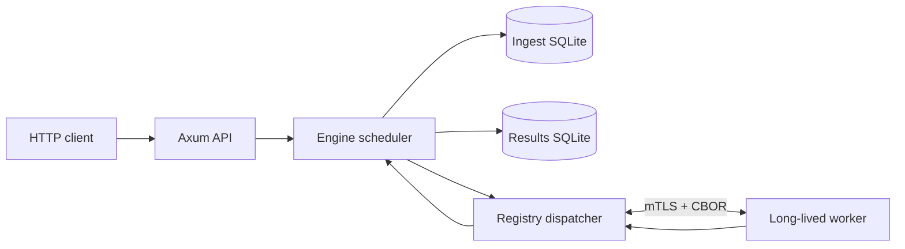
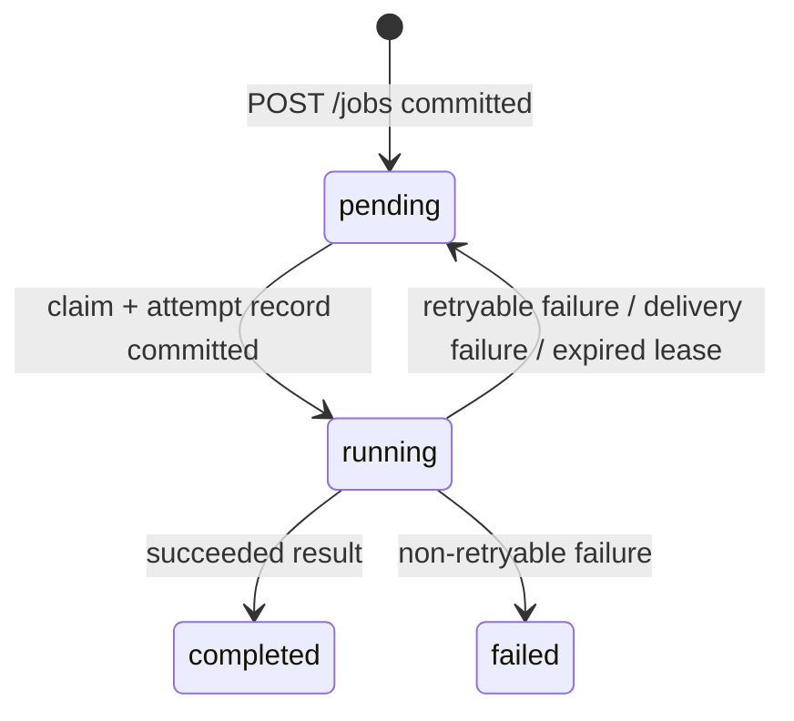

# Maqistor project reference

Maqistor is a local, durable asynchronous job system. Clients submit JSON jobs over HTTP. Maqistor persists them in SQLite, reserves capacity from long-lived workers, dispatches jobs over mutually authenticated TLS, and durably records worker outcomes.

This file is the repository-level orientation guide. Source code remains authoritative for exact behavior.

## Start here

| Need | Read |
| --- | --- |
| Run Maqistor | `maqistor.example.toml`, `crates/maqistor/src/main.rs` |
| Submit or fetch jobs | `crates/api/src/lib.rs` |
| Understand scheduling and retries | `crates/engine/src/lib.rs`, `crates/engine/src/types.rs` |
| Understand SQLite durability | `crates/persistence/src/sqlite/` |
| Build a non-Rust worker SDK | `crates/worker-protocol/PROTOCOL.md`, `crates/worker-protocol/worker-protocol-v1.cddl` |
| Build a Rust worker | `crates/worker-sdk/src/lib.rs` |
| Run capacity tests | `benchmark/README.md`, `benchmark/run.py` |

## Workspace map

| Path | Responsibility |
| --- | --- |
| `crates/maqistor` | Binary, TOML loading, startup wiring, logging |
| `crates/api` | Axum HTTP adapter |
| `crates/engine` | Domain types, scheduler, storage and dispatcher ports |
| `crates/persistence` | Split SQLite implementation of the durable-store port |
| `crates/dispatcher` | Worker registry, mTLS listener, Docker-managed workers |
| `crates/worker-protocol` | Versioned CBOR framing, Rust types, CDDL schema, protocol guide |
| `crates/worker-sdk` | Typed async Rust worker runtime |
| `benchmark/noop-worker` | Rust worker used by the benchmark environment |
| `benchmark` | oha-driven ingest and full-cycle capacity testing |

`Cargo.toml` defines a Rust 2024 workspace. The runtime packages are all version `0.1.0`.

## System model



The two SQLite files have different write paths:

- The ingest database owns queue definitions and the lightweight job row.
- The results database owns one attempt row per dispatch, including lease and outcome data.
- A composed job view reads the ingest row plus the most recent attempt row.

This split lets submission/claim writes and completion writes use independent writer loops. It is a local durability design, not a distributed database or a multi-host control plane.

Hot-path writers share set-oriented SQL helpers in `crates/persistence/src/sqlite/bulk.rs`: multi-row `INSERT` and `WITH … AS (VALUES …) UPDATE … FROM` chunks (64 rows per statement, `prepare_cached`), used by enqueue, claim, repend, `insert_running`, and complete.

## Job lifecycle

### Domain records

`Job` contains a durable integer ID, queue name, status, raw JSON payload bytes, execution count, optional lease/dispatch fence, optional result, and millisecond timestamps. `JobQueue` contains the queue name, `max_retries`, and `timeout_secs`.

The externally visible statuses are `pending`, `running`, `completed`, and `failed`.



`dispatch_id` is a UUID fencing token created on every claim. A worker result must carry the same job ID and dispatch ID; stale or duplicate results are ignored by persistence.

`max_retries` is stored with each attempt at claim time. With `max_retries = 0`, the first failed execution becomes terminal. A positive setting permits requeueing while the attempt execution count is within that stored limit.

### Submission and read flow

1. `POST /jobs` validates a JSON request with `name` and `payload`.
2. The engine serializes `payload` to JSON bytes and asks the store to enqueue a pending job.
3. The ingest writer commits the insertion and returns the durable job ID.
4. The engine wakes the named queue.
5. `GET /jobs/{id}` composes the ingest job row and latest result attempt into a `JobView`.

Unknown queues and invalid payload serialization map to HTTP 400; unknown jobs map to 404; storage failures map to 500.

### Scheduling and delivery flow

1. Queue wakeups are coalesced so a queue has one active pass plus at most one requested re-wake.
2. The engine asks the dispatcher to reserve worker slots, bounded by `dispatch.batch_size_max` and the hard `MAX_CLAIM_BATCH_SIZE` of 16,384.
3. The engine acquires a global delivery budget bounded by `dispatch.max_in_flight` before claiming work.
4. The ingest store claims only as many pending jobs as reserved capacity permits.
5. The results store writes corresponding running-attempt rows with lease expiry timestamps.
6. Delivery work enters a bounded channel; the delivery pump writes a `job_dispatch` frame through the reserved worker connection.
7. A failed delivery releases its reservation and returns the matching claim to pending.
8. A worker result becomes a dispatcher event. The engine persists it and wakes the queue again when a retryable failure was requeued.

The scheduler also calls stale-lease recovery every 30 seconds. Startup recovery performs the same repair unless `persistence.startup = "preserve"`.

## Persistence

### Files and schema

Both databases are schema version 1. Opening a different version fails rather than migrating it; remove obsolete development databases after a schema break.

| Database | Tables | Main indexes and purpose |
| --- | --- | --- |
| Ingest | `job_queues`, `jobs` | FIFO pending index on `(queue_name, created_at, id)` |
| Results | `job_attempts` | Latest-attempt index by job and stale-running-lease index |

The ingest job row is `pending` or `claimed`. A claimed row has a dispatch ID. The results attempt row is `running`, `completed`, or `failed`.

On open, `SqliteStore` repairs an ingest row that is still claimed but has no matching result attempt. During an ordinary claim, it first claims ingest rows and then writes running attempts; if that second step fails, it re-pends the affected ingest rows.

### SQLite behavior

- Each writable connection enables WAL, foreign keys, and a five-second busy timeout.
- `balanced` durability uses SQLite `synchronous=NORMAL`; `strict` uses `FULL`.
- Each database has four read-only query connections used round-robin through `spawn_blocking`.
- `default_results_path` maps `*-ingest.db` to `*-results.db`.

### Adaptive writers

Ingest and results each own a dedicated asynchronous writer loop. Each loop batches work and independently adapts its batch size and waiting window.

The controller observes request rate, commit rate, commit duration, fill ratio, backlog, and sparse timeout batches. It uses EWMAs plus repeated-direction confirmation to grow under demand and back off under congestion or sustained low fill. The tuning parameters are intentionally configurable because they are core system behavior.

Default policy:

| Setting | Enqueue | Completion |
| --- | ---:| ---:|
| Minimum batch size | 64 | 128 |
| Maximum batch size | 8,192 | 8,192 |
| Minimum wait | 1 ms | 1 ms |
| Maximum wait | 100 ms | 20 ms |
| EWMA window | 16 | 16 |
| Probe factor | 1.10 | 1.25 |
| Backoff factor | 0.80 | 0.80 |

## Worker transport

The worker listener is separate from the HTTP listener and requires mutual TLS. Server certificates, the client-verification CA, and worker client certificates are configured by file path.

`crates/worker-protocol/worker-protocol-v1.cddl` is the machine-readable protocol definition. `crates/worker-protocol/PROTOCOL.md` is the language-neutral implementation guide. Future SDKs must use both.

Transport rules:

- One connection represents one worker instance serving one queue.
- A frame is a four-byte unsigned big-endian body length followed by CBOR.
- CBOR bodies are limited to 1 MiB.
- Every frame declares `protocol_version = 1`; unknown versions are rejected.
- A worker must send `register` first and receives `registered` after acceptance.
- Workers send `heartbeat` while connected; the Rust SDK uses a five-second interval.
- The server sends `job_dispatch`; workers answer with exactly one `job_result` per dispatch.
- Result capacity fields are a complete snapshot of `running_jobs` and `free_slots`, not a delta.

Protocol message set:

| Message | Direction | Purpose |
| --- | --- | --- |
| `register` | Worker → server | UUID, queue, and initial capacity |
| `registered` | Server → worker | Registration acknowledgement |
| `job_dispatch` | Server → worker | Job ID, dispatch fence, execution count, raw JSON bytes |
| `job_result` | Worker → server | Success/failure outcome plus capacity snapshot |
| `heartbeat` | Worker → server | Keepalive |
| `error` | Server → worker | Terminal protocol or registration error |

## Dispatcher and worker execution

### Registry dispatcher

`RegistryDispatcher` implements the engine's `WorkerDispatcher` port over `WorkerRegistry`.

- Reservation finds a worker in the requested queue with unreserved free slots and creates an opaque `RegistryPermit`.
- Dispatch serializes outbound frames through a per-worker writer channel and waits for the writer acknowledgement.
- When a result arrives, the worker's reported capacity replaces the registry's prior reservation estimate.
- Duplicate worker instance IDs, unknown queues, invalid first frames, TLS failures, and protocol violations are rejected.
- Disconnect removes the worker from the registry.

### Managed workers

For `mode = "managed"`, `DockerWorkerSupervisor` reconciles the requested replicas every five seconds. It starts existing matching containers, pulls missing images, creates missing containers, and replaces only containers labelled `io.maqistor.managed=true` when their image differs. Managed containers use Docker's `unless-stopped` restart policy.

For `mode = "external"`, Maqistor does not create containers. Workers connect independently using the configured TLS material and queue name.

### Rust worker SDK

Implement the `Queue` trait with a static queue name and a deserializable payload type, then construct `Worker::new(connection, concurrency, handler).run().await`.

The SDK opens mTLS, registers, reads dispatches, deserializes JSON payload bytes, enforces the configured `NonZeroU32` concurrency with a semaphore, invokes each handler in a Tokio task, and sends `job_result` frames. Handler success returns arbitrary bytes; handler failure returns a string.

## HTTP API

The HTTP API has no authentication or authorization layer. It is intended for a trusted local or application-controlled network boundary.

| Route | Request | Success | Errors |
| --- | --- | --- | --- |
| `GET /health` | none | `204 No Content` | none defined |
| `POST /jobs` | `{ "name": string, "payload": any }` | `201` with `{ "id", "name", "status" }` | 400, 500 |
| `GET /jobs/{id}` | integer path segment | `200` with `{ "id", "name", "status" }` | 404, 500 |

Axum tracing middleware is installed on the router. API responses intentionally expose status only; payloads, attempts, leases, and result bodies are not exposed by the current HTTP contract.

## Configuration and startup

Run the binary from the workspace root:

```powershell
.\target\release\maqistor.exe --config maqistor.toml
```

`maqistor.example.toml` documents a valid external-worker setup. Unknown TOML fields are rejected.

| Section | Key fields | Notes |
| --- | --- | --- |
| Root | `listen`, `worker_listen` | Default `0.0.0.0:7828` and `0.0.0.0:7829`; they must differ |
| `worker_tls` | `ca_cert_path`, `cert_path`, `key_path` | Required server and client-verification material |
| `persistence` | database paths, `durability`, `startup` | Defaults to `./data/maqistor-ingest.db` and `./data/maqistor-results.db` |
| `persistence.enqueue` | batch limits, waits, EWMA, probe/backoff | Overrides ingest adaptive policy |
| `persistence.completion` | same fields | Overrides completion adaptive policy |
| `dispatch` | `batch_size_max`, `max_in_flight` | Defaults to 8,192 and 1,024; batch cap must be ≤16,384 |
| `queues` | name, mode, retry/timeout policy | One or more queue declarations |

Managed queues require a nonempty image and positive replicas. Images must use an explicit tag or SHA-256 digest; `latest` and `stable` are rejected. External queues cannot set an image or replicas.

Startup order is: initialize tracing, load and validate TOML, open both databases, upsert configured queues, optionally recover stale leases, start the mTLS listener, start managed-worker reconciliation, build the engine, start result consumption, and bind HTTP.

## Benchmark suite

The benchmark is an external Python orchestrator for a standing Maqistor process. It uses `oha` for HTTP load and reads both SQLite files for full-cycle measurements.

The benchmark environment uses:

- HTTP `127.0.0.1:18081` and worker listener `0.0.0.0:17829`.
- A managed `bench` queue using image `maqistor-benchmark-noop-worker:0.1.3`.
- 16 replicas. The no-op worker defaults to 16 slots unless `MAQISTOR_WORKER_CONCURRENCY` overrides it.
- Generated short-lived local mTLS material under `benchmark/certs`.
- Balanced durability and aggressive adaptive batching settings in `benchmark/maqistor.toml`.

Build and run:

```powershell
sh benchmark/generate-certs.sh
docker build -f benchmark/noop-worker/Dockerfile -t maqistor-benchmark-noop-worker:0.1.3 .
cargo build --release -p maqistor
.\target\release\maqistor.exe --config benchmark\maqistor.toml
python benchmark\run.py --mode full --open-qps 4000,4500,5000 --duration 180 --settle-seconds 0
```

`run.py` supports `closed`, `open`, `both`, and `full` modes. It writes raw oha JSON to `benchmark/results/raw` and timestamped JSON summaries to `benchmark/results`.

| Metric | Meaning |
| --- | --- |
| `queued/s` | Successful HTTP enqueue rate reported by oha |
| `done/s` | Completed jobs divided by offer duration plus drain duration |
| `backlog` | Pending ingest rows plus running attempts after the pre-test watermark |
| `drain_s` | Time to clear that backlog after the offered-load window |
| `cyc_p50ms`, `cyc_p99ms` | Durable create-to-complete time from SQLite timestamps |

The current `stable` marker evaluates enqueue success, HTTP p99, and a successful drain. It does not enforce an end-to-end cycle latency target or require zero backlog at the end of the offered-load window. Use backlog, drain time, and cycle percentiles when judging full-cycle capacity.

## Tests and checks

```powershell
cargo check --workspace --all-targets
cargo test --workspace
cargo clippy --workspace --all-targets -- -W dead_code
```

The test suite covers HTTP submission, scheduler reservation/delivery behavior, worker-capacity accounting, protocol round trips, configuration validation, SQLite queues/claims/leases/retries/fencing, split-store repair, mixed ingest/completion traffic, and adaptive batching invariants.

## Operational boundaries

- SQLite files are local durable state. Back them up or manage their lifecycle outside the binary.
- The worker protocol is versioned, but only version 1 exists today.
- Worker TLS is mandatory; HTTP TLS, authentication, authorization, rate limiting, and multi-node coordination are not implemented.
- Benchmark results are machine- and configuration-specific. Separate enqueue throughput from durable end-to-end completion throughput.
- Delete both paired benchmark databases after a schema cut; version mismatches are intentionally not migrated.
